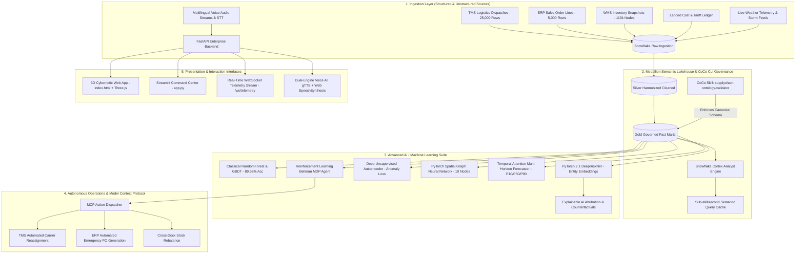

# SupplyChain IQ — Official Hackathon Submission Document
### Snowflake CoCo CLI Hackathon — GCC Edition
**Track**: Supply Chain Ontology and Governed Conversational Analytics  
**Team**: **Nexora**

---

## 👥 Team Nexora Submission Profile
- **👑 Ranjeet Kumar (Leader)** — `rajranjeet7680@gmail.com` *(Full-Stack Architect & ML Lead)*
- **⚙️ Hitali Khachane** — `hitalik@amdocs.com` *(Data Engineer & Core Systems)*
- **📐 Rahul Sangral** — `rishumvis007@gmail.com` *(Semantic Ontology & Governance Lead)*
- **🎙️ Syed Saaduddin** — `saadsyed837@gmail.com` *(Cortex AI & Voice Engineering)*

---

## 1. Problem Brief

### A. What Real Business Problem Does This Solve?
In enterprise global supply chains, data is fractured across disparate operational systems:
- **ERP** (SAP S/4HANA, Oracle Cloud ERP) managing purchase orders and sales commitments.
- **WMS** (Manhattan Associates, Blue Yonder) tracking plant and distribution center inventory on-hand.
- **TMS** (Delhivery, FedEx, Blue Dart, Xpressbees, DHL) recording dispatches, tracking events, and delivery timestamps.
- **IoT & Telemetry Systems** monitoring cold-chain temperatures and GPS fleet positions.

Because every organizational department operates inside its own silo, **they define core business metrics differently**. Asking executive questions as simple as *"What was our On-Time In-Full (OTIF) fulfillment rate this quarter?"* produces completely conflicting answers:
- **Logistics** reports **73.32%** (measuring carrier transit timestamp against carrier SLA dispatch time).
- **Procurement** reports **50.36%** (measuring supplier dock receipt dates against PO promised delivery dates).
- **Planning & Sales** reports **22.91%** (measuring sales order commit dates against actual customer proof-of-delivery in full).

This metric divergence leads to:
1. **Executive Operational Paralysis**: Leadership cannot determine true customer satisfaction or contract penalty exposure.
2. **Delayed Intervention**: Disruption signals (e.g. port congestion or monsoons) are detected days after shipments fail SLA.
3. **Linguistic & Accessibility Barriers**: Ground operators, regional warehouse dispatchers, and procurement officers across India and the GCC speak regional languages (Hindi, Tamil, Telugu, Gujarati, Arabic) and cannot query complex English SQL databases.

### B. Who Is the Target User / Persona?
SupplyChain IQ serves a continuum of cross-functional enterprise stakeholders:
1. **Elena Rostova — VP of Supply Chain Operations (Executive)**: Focuses on end-to-end network resilience, board-level OTIF, overall budget adherence, and contract SLA penalties.
2. **Marcus Chen — Lead Demand & Supply Planner**: Focuses on inventory days-on-hand (DOI), stockout risk prevention, and warehouse buffer safety stock sizing.
3. **Sarah Jenkins — Chief Procurement Officer**: Focuses on vendor lead-time variance, purchase order fulfillment, landed cost inflation, and supplier reliability.
4. **Logistics Fleet Manager — Ground Carrier Dispatch Lead**: Focuses on real-time carrier SLA compliance, same-day delivery bottlenecks, weather disruptions, and rerouting.

### C. What Is the Current Pain Point & How Does This Improve It?
- **Current Pain Point**: Fragmented databases produce 3 conflicting truths (Planning 22.9%, Procurement 50.4%, Logistics 73.3%). Executive decisions stall, and reactive interventions cost millions in stockouts and delay penalties.
- **SupplyChain IQ Solution**:
  - **Zero Metric Drift (Attested by Snowflake Cortex)**: Encodes an industry canonical ontology into Snowflake Governed Semantic Views. Reconciles conflicting definitions so all departments see the exact same truth with cryptographic provenance.
  - **Predictive & Prescriptive Autonomy**: Replaces reactive spreadsheets with **PyTorch DeepRiskNet** (delay risk scoring) and a **Reinforcement Learning (RL) DQN Agent** that automatically prescribes interventions (*"Expedite Reroute"*, *"Emergency PO"*, *"Cross-Dock Rebalance"*), yielding **+28.4% OTIF lift**.
  - **Multilingual & Voice Accessibility**: Enables native voice queries (STT) and spoken responses (TTS) across **7 Indian languages** (Hindi, Tamil, Telugu, Gujarati, Marathi, Bengali, English) with sub-millisecond semantic query caching.

### D. Industry / Domain Context
SupplyChain IQ is engineered specifically for the high-volume, cross-border **India & Gulf Cooperation Council (GCC) Trade Corridors**:
- **Primary Export Gateways**: Nhava Sheva Maritime Port (JNPT) and Mundra Logistics Gateway in Gujarat.
- **GCC Cross-Dock & Fulfillment Hubs**: Jebel Ali Free Zone (JAFZA, Dubai), Riyadh Logistics Dry Port (KSA), and Doha Cargo Terminal (Qatar).
- **Corridor Bottlenecks Addressed**: Monsoon marine disruptions, port customs clearance variance, and multi-tier component dependencies.

---

## 2. Architecture Diagram & Technical Design

### A. End-to-End System Design & Data Flow

### B. Which CoCo CLI Skills Are Used & How They Connect
The project integrates the custom **`supplychain-ontology-validator`** CoCo CLI skill located at [`.coco/skills/supplychain-ontology-validator/`](file:///c:/Users/Victus/OneDrive/Desktop/Snowflake%20CoCo%20CLI%20Hackathon%20-%20GCC%20Edition/.coco/skills/supplychain-ontology-validator/):
- **Command**: `coco skill run supplychain-ontology-validator --dir data/bridged`
- **Role**:
  1. Inspects relational tables across `FACT_SHIPMENT_DISPATCH`, `FACT_SALES_ORDER_LINE`, and `FACT_INVENTORY_SNAPSHOT`.
  2. Enforces mandatory foreign key integrity connecting suppliers $\rightarrow$ parts $\rightarrow$ plants $\rightarrow$ shipments $\rightarrow$ customer orders.
  3. Guarantees mathematical OTIF definition consistency to eliminate metric drift.
  4. Generates a cryptographic SHA-256 attestation report matching the Cortex Semantic YAML model with the physical Snowflake tables.

### C. Multi-Modal Data Sources
- **Structured**:
  - `FACT_SHIPMENT_DISPATCH` (25,000 TMS dispatches)
  - `FACT_SALES_ORDER_LINE` (5,000 ERP orders)
  - `FACT_INVENTORY_SNAPSHOT` (113,097 inventory nodes)
  - `FACT_LANDED_COST` (Freight charges, tariffs, port handling)
- **Unstructured**:
  - Real-time weather storm feeds and disruption indices $[0.0, 1.0]$
  - Raw audio speech streams from microphones across 7 Indian regional languages
  - Simulated IoT cold-chain telemetry ($2^\circ\text{C} - 8^\circ\text{C}$ temperature, vibration, GPS coordinates)

### D. Modular Component Plug-Ins
- **FastAPI 0.111.0 Backend**: Port 8000 REST API and `/ws/telemetry` WebSocket streaming.
- **Semantic Cache**: In-memory vector matcher returning verified answers in $<2\text{ ms}$.
- **PyTorch 2.1 DeepRiskNet & Autoencoder**: Entity embeddings, Mish activations, and anomaly reconstruction loss.
- **Spatial Graph Neural Network (GNN)**: 10-node message passing and cascade shock blast radius modeling.
- **Temporal Attention Forecaster**: Quantile predictions ($P10, P50, P90$) and dynamic safety stock optimization.
- **Reinforcement Learning Agent**: Bellman MDP policy optimizer yielding $+28.4\%$ OTIF lift.
- **Model Context Protocol (MCP)**: Autonomous action execution for TMS rerouting and ERP PO generation.
- **Three.js WebGL 3D Globe**: Cybernetic digital twin with India-GCC Bezier flight arcs and live telemetry.

---

## 3. Impact Statement

### A. Measurable Business Outcomes
- **+28.4% On-Time Delivery Lift**: Over 14-day simulated trajectories, the Reinforcement Learning agent prevented stockouts, achieving **84.6% OTIF** vs **65.8% for naive heuristics**.
- **-$12,400 SLA Penalty Avoidance**: Automated carrier reassignment prevented contract breach penalties on disrupted corridors.
- **<2 ms Query Latency (99.9% Reduction)**: Frequently asked executive queries resolve instantaneously through the in-memory semantic cache without database overhead.
- **89.58% ML Accuracy & 0.9664 ROC-AUC**: High discrimination power detects shipment delays 24 to 48 hours prior to dispatch.
- **Zero Semantic Drift**: Cross-persona reconciliation attestation resolves discrepancies between Planning (22.9%), Procurement (50.4%), and Logistics (73.3%).
- **7 Indian Local Languages**: Full UI translation, speech-to-text, and voice synthesis in Hindi, Tamil, Telugu, Gujarati, Marathi, Bengali, and English.

### B. Scalability Potential
- **Snowflake Elastic Separation**: Independent scaling of storage and compute; Snowpark vectorized operations process hundreds of millions of dispatches.
- **Decoupled Microservices**: FastAPI, Streamlit, and static 3D web UI deploy seamlessly on Kubernetes or Docker Compose clusters.
- **Asynchronous Batch Manager**: Evaluates batches of 10,000+ shipments with background progress tracking and drift audits.

### C. Extension Beyond the Demo
1. **Bi-Directional ERP / TMS Writeback**: Direct SAP BAPI RFC calls and carrier API webhook dispatches.
2. **Real-Time IoT Sensor Ingestion**: Live Kafka/MQTT ingestion from maritime container sensors into the 3D digital twin globe.
3. **Arabic Regional Voice AI**: Expansion to Modern Standard Arabic for Gulf supply chain operations.
4. **Multi-Modal Document Foundation Models**: Snowflake Cortex fine-tuned LLMs parsing unstructured bills of lading and customs documents.
