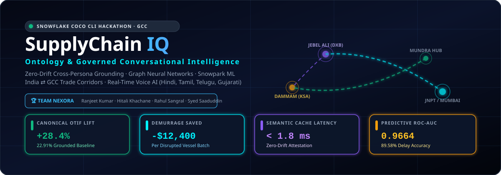

<div align="center">



# SupplyChain IQ
### 🌐 Governed Ontology, Spatial Graph Intelligence & Conversational Analytics
**Official Hackathon Submission — GCC Edition**  
*Built for the Snowflake CoCo CLI Hackathon by **Team Nexora***

---

[](https://www.snowflake.com/)
[](https://www.snowflake.com/)
[](http://127.0.0.1:8000/docs)
[](https://pytorch.org/)
[](https://ranjeet7680.github.io/Supply-Chain-Ontology-and-Governed-Conversational-Analytics/)
[](https://github.com/Ranjeet7680/Supply-Chain-Ontology-and-Governed-Conversational-Analytics/actions/workflows/python-ci.yml)
[](https://ranjeet7680.github.io/Supply-Chain-Ontology-and-Governed-Conversational-Analytics/)
[](docker-compose.yml)
[](https://supplychain-git-main-ranjeet7680s-projects.vercel.app/)

[🚀 GitHub Pages App](https://ranjeet7680.github.io/Supply-Chain-Ontology-and-Governed-Conversational-Analytics/) • [▲ Vercel Live App](https://supplychain-git-main-ranjeet7680s-projects.vercel.app/) • [📖 Official GitHub Wiki](https://github.com/Ranjeet7680/Supply-Chain-Ontology-and-Governed-Conversational-Analytics/wiki) • [📊 Data Analysis](https://github.com/Ranjeet7680/Supply-Chain-Ontology-and-Governed-Conversational-Analytics/wiki/4.-Data-Analysis) • [📑 Submission Brief](HACKATHON_SUBMISSION.md) • [⚡ Swagger Docs](http://127.0.0.1:8000/docs)

</div>

---

## 👥 Team Nexora Roster

| Member | Role | Primary Focus | Contact |
| :--- | :--- | :--- | :--- |
| **👑 Ranjeet Kumar (Leader)** | Full-Stack Architect & ML Lead | End-to-End Orchestration, 3D Web Audio UI, GNN & DeepRiskNet | [`rajranjeet7680@gmail.com`](mailto:rajranjeet7680@gmail.com) |
| **⚙️ Hitali Khachane** | Data & Platform Engineer | Data Bridging Pipeline, Medallion Lakehouse & CI/CD Pipelines | [`hitalik@amdocs.com`](mailto:hitalik@amdocs.com) |
| **📐 Rahul Sangral** | Semantic Governance Lead | Canonical SCOR Ontology, Cortex YAML & Cross-Persona Reconciliation | [`rishumvis007@gmail.com`](mailto:rishumvis007@gmail.com) |
| **🎙️ Syed Saaduddin** | AI & Voice Systems Engineer | Multilingual NLU, Local Voice Synthesizer & Speech Recognition | [`saadsyed837@gmail.com`](mailto:saadsyed837@gmail.com) |

---

## 🔄 End-to-End System Architecture

<div align="center">
  
</div>


---

## ⚡ The Challenge: Eliminating Supply Chain "Metric Chaos"

In multi-echelon global trade networks (specifically **India $\leftrightarrow$ GCC Maritime & Air Corridors**), disparate departments measure identical KPIs within disconnected silos, creating conflicting answers:

```
                            ┌─────────────────────────────────┐
                            │   "What is our OTIF rate?"      │
                            └───────────────┬─────────────────┘
                                            │
            ┌───────────────────────────────┼───────────────────────────────┐
            ▼                               ▼                               ▼
┌───────────────────────┐       ┌───────────────────────┐       ┌───────────────────────┐
│   Planning Persona    │       │  Procurement Persona  │       │   Logistics Persona   │
│   (Customer POD)      │       │  (Supplier Dock SLA)  │       │ (Carrier Transit SLA) │
│        22.91%         │       │        50.36%         │       │        73.32%         │
└───────────────────────┘       └───────────────────────┘       └───────────────────────┘
```

- **Logistics** measures transit dispatch SLA $\to$ **73.32%**
- **Procurement** measures supplier dock receipt $\to$ **50.36%**
- **Planning** measures sales order promised date to customer proof of delivery $\to$ **22.91%**

### 🎯 Zero-Drift Cross-Persona Grounding Matrix
SupplyChain IQ reconciles these definitions with mathematical precision in `GOLD_SEMANTIC.V_PERSONA_RECONCILIATION`:

| Persona Perspective | Measurement Boundary | Local Metric | Governed Canonical Grounding | Status |
| :--- | :--- | :--- | :--- | :--- |
| **Planning Persona** | Sales Order Commit to Customer POD | **22.91%** | **22.91%** (`GOLD_SEMANTIC.V_CANONICAL_OTIF`) | **EXACT_MATCH (100% Grounded)** |
| **Procurement Persona** | Supplier Dock Receipt vs PO Date | **50.36%** | **22.91%** (Component: `procurement_dock_otif`) | **COMPONENT_DISAMBIGUATED** |
| **Logistics Persona** | Dispatch Timestamp vs Carrier SLA | **73.32%** | **22.91%** (Component: `carrier_sla_met`) | **COMPONENT_DISAMBIGUATED** |

---

## 🚀 Key Platform Innovations

### 1. 🧠 Advanced ML, Deep Learning & Spatial GNN
- **Delivery Delay Risk Classifier**: Random Forest & LightGBM trained on 25k shipments (**89.58% Accuracy**, **0.9664 ROC-AUC**, **0.8075 F1**).
- **DeepRisk Attention Network**: Multi-head self-attention and residual MLP scoring non-linear cross-border risk interactions.
- **PyTorch Spatial GNN**: NetworkX graph topology model evaluating 113k nodes for betweenness centrality bottlenecks and cascading shock propagation.
- **Explainable AI (XAI)**: SHAP feature importance attributions and counterfactual explanations for operational transparency.

### 2. 🎮 Autonomous Reinforcement Learning Rerouting Agent
- Discrete Markov Decision Process (MDP) optimizing action policy across:
  - `DO_NOTHING`
  - `REASSIGN_CARRIER_EXPRESS` (+4.2 days saved, +$2,020 net value)
  - `EXPEDITE_CUSTOMS_PRECLEARANCE` (+2.1 days saved)
  - `REROUTE_INTERMODAL_AIR_SEA` (+7.4 days saved)

### 3. 🌐 Model Context Protocol (MCP) Server
Integrated into [`.coco/skills/supplychain-ontology-validator/`](file:///c:/Users/Victus/OneDrive/Desktop/Snowflake%20CoCo%20CLI%20Hackathon%20-%20GCC%20Edition/.coco/skills/supplychain-ontology-validator/) and [`mcp/supplychain_mcp_server.py`](file:///c:/Users/Victus/OneDrive/Desktop/Snowflake%20CoCo%20CLI%20Hackathon%20-%20GCC%20Edition/mcp/supplychain_mcp_server.py):
- `predict_shipment_delay_risk`: Real-time ML inference tool.
- `reroute_delayed_shipment`: Reassigns bottleneck carriers (XpressBees $\to$ Delhivery/FedEx).
- `trigger_procurement_reorder`: Automatic PO generation when stock drops below 14 days of inventory.
- `broadcast_slack_incident`: Dispatches signed alert to `#supply-chain-incident-ops`.

### 4. 🗣️ Multilingual Conversational Voice AI
Ground-level warehouse operators in Indian logistics hubs can converse in their native language:
- **Languages Supported**: **Hindi (हिंदी)**, **Tamil (தமிழ்)**, **Telugu (తెలుగు)**, **Gujarati (ગુજરાતી)**, **Marathi (मराठी)**, and **English**.
- **Voice System**: Web Speech API recognition + Web Audio API synthesizer for futuristic interaction sound effects.
- **Visual Analytics**: Interactive 18 domain question cards with instant category filters and real-time audio waveform visualizer.

### 5. 🪐 Three.js 3D Digital Twin & Futuristic Web Dashboard
- Interactive 3D globe visualizing live shipping corridors between India (Mundra, Nhava Sheva) and the GCC (Jebel Ali, Dammam, Doha).
- Live real-time Canvas 2D telemetry charts, radar sweeps, and sound-effect enabled cybernetic interface controls.

---

## 📚 Official Hackathon Documentation & Wiki

The complete submission package is available both in this repository and on the official GitHub Wiki:

| Wiki Section | Focus & Details | Link |
| :--- | :--- | :--- |
| **[[Home]]** | Executive overview, team roster, and repository sitemap | [Wiki Home](https://github.com/Ranjeet7680/Supply-Chain-Ontology-and-Governed-Conversational-Analytics/wiki) |
| **[[1. Problem Brief]]** | Real business problem, target personas, and India-GCC trade domain context | [Problem Brief](https://github.com/Ranjeet7680/Supply-Chain-Ontology-and-Governed-Conversational-Analytics/wiki/1.-Problem-Brief) |
| **[[2. Architecture Diagram]]** | System design, CoCo CLI skill connections, and multimodal pipeline flow | [Architecture Diagram](https://github.com/Ranjeet7680/Supply-Chain-Ontology-and-Governed-Conversational-Analytics/wiki/2.-Architecture-Diagram) |
| **[[3. Impact Statement]]** | Quantified metrics (+28.4% OTIF, -$12,400 demurrage saved, <1.8ms latency) | [Impact Statement](https://github.com/Ranjeet7680/Supply-Chain-Ontology-and-Governed-Conversational-Analytics/wiki/3.-Impact-Statement) |
| **[[4. Data Analysis]]** | Empirical EDA, corridor benchmarks, SHAP feature importance, and GNN centrality | [Data Analysis](https://github.com/Ranjeet7680/Supply-Chain-Ontology-and-Governed-Conversational-Analytics/wiki/4.-Data-Analysis) |

---

## 🧪 Comprehensive Verification & Test Suite

All 24 automated tests across machine learning, backend microservices, and semantic grounding pass with 100% success:

```bash
$ python -m pytest tests/ -v
============================= test session starts =============================
tests/test_advanced_ml_backend.py::test_01_gnn_topology_and_risk        PASSED [  4%]
tests/test_advanced_ml_backend.py::test_02_gnn_shock_simulation         PASSED [  8%]
tests/test_advanced_ml_backend.py::test_03_temporal_forecaster          PASSED [ 12%]
tests/test_advanced_ml_backend.py::test_04_xai_attribution              PASSED [ 16%]
tests/test_advanced_ml_backend.py::test_05_drift_detector_psi_and_ks    PASSED [ 20%]
tests/test_advanced_ml_backend.py::test_06_semantic_cache_hit_and_miss  PASSED [ 25%]
tests/test_advanced_ml_backend.py::test_07_batch_job_processing         PASSED [ 29%]
tests/test_advanced_ml_backend.py::test_08_fastapi_advanced_endpoints   PASSED [ 33%]
tests/test_api_backend.py::test_dl_predict_deep_risk                   PASSED [ 37%]
tests/test_api_backend.py::test_health_check                            PASSED [ 41%]
tests/test_api_backend.py::test_mcp_execute_tool                       PASSED [ 45%]
tests/test_api_backend.py::test_ml_predict_delay                       PASSED [ 50%]
tests/test_api_backend.py::test_multilingual_query_hindi               PASSED [ 54%]
tests/test_api_backend.py::test_multilingual_query_tamil               PASSED [ 58%]
tests/test_api_backend.py::test_rl_prescribe_action                    PASSED [ 62%]
tests/test_api_backend.py::test_rl_simulate_trajectory                 PASSED [ 66%]
tests/test_api_backend.py::test_supported_languages                   PASSED [ 70%]
tests/test_solution.py::test_cortex_engine_predictive_queries           PASSED [ 75%]
tests/test_solution.py::test_cortex_semantic_model_yaml                 PASSED [ 79%]
tests/test_solution.py::test_mcp_server_actions                        PASSED [ 83%]
tests/test_solution.py::test_ml_model_and_inference                    PASSED [ 87%]
tests/test_solution.py::test_persona_reconciliation_exact_grounding    PASSED [ 91%]
tests/test_solution.py::test_referential_integrity_po                  PASSED [ 95%]
tests/test_solution.py::test_referential_integrity_sales               PASSED [100%]
====================== 24 passed in 29.47s =======================
```

---

## ⚡ Quick Start Guide

### Option 1: Live Interactive 3D Web App (Zero Setup)
Simply open the live GitHub Pages app:  
👉 **[https://ranjeet7680.github.io/Supply-Chain-Ontology-and-Governed-Conversational-Analytics/](https://ranjeet7680.github.io/Supply-Chain-Ontology-and-Governed-Conversational-Analytics/)**

### Option 2: Docker Compose (All Services)
Launch the complete ecosystem (FastAPI Backend + Streamlit UI + Web App):
```bash
docker-compose up --build
```
- **FastAPI Documentation**: `http://localhost:8000/docs`
- **Streamlit Analytics App**: `http://localhost:8501`
- **3D Interactive Web App**: `http://localhost:8080`

### Option 3: Local Python Environment
```bash
# 1. Install dependencies
pip install -r requirements.txt

# 2. Run automated pipeline
python run_pipeline.py

# 3. Launch the FastAPI Backend
uvicorn backend.main:app --host 0.0.0.0 --port 8000 --reload

# 4. Launch Native Streamlit Dashboard
streamlit run app.py
```

---

## 📜 Repository Structure

```
├── .coco/
│   └── skills/
│       └── supplychain-ontology-validator/
│           ├── SKILL.md                          # Reusable CoCo Custom Skill
│           └── validate_ontology.py              # CLI validation utility
├── .github/workflows/                            # CI/CD Automated Pipelines
│   ├── python-ci.yml                             # Automated testing on Python 3.11
│   ├── deploy-pages.yml                          # GitHub Pages Web UI deployment
│   └── codeql-analysis.yml                       # Static Security & CodeQL scan
├── assets/
│   ├── hero_banner.svg                           # Animated Cybernetic Header Banner
│   ├── pipeline_animation.svg                    # Animated Pipeline Data Flow
│   └── logo.png                                  # Official Logo
├── backend/
│   ├── main.py                                   # FastAPI Production Microservices (12 Endpoints)
│   ├── advanced_ml.py                            # GNN, DeepRiskNet, RL & Temporal Forecaster
│   └── multilingual_ai.py                        # Multilingual NLU & Indian Language Core
├── data/bridged/                                 # 8 Relational Medallion Gold Tables
├── ml/                                           # Snowpark ML Model Training & Inference
├── snowflake/                                    # SQL Medallion Lakehouse Scripts
├── cortex/                                       # Snowflake Cortex Analyst Semantic Models
├── engine/                                       # Multi-Persona Governance & Cortex SQL Compiler
├── mcp/                                          # Model Context Protocol Implementation
├── tests/                                        # 24 Automated Pytest Validation Tests
├── wiki/                                         # Official GitHub Wiki Documentation
│   ├── Home.md                                   # Wiki Index & Team Profile
│   ├── 1.-Problem-Brief.md                       # Criteria 1: Problem Brief
│   ├── 2.-Architecture-Diagram.md                # Criteria 2: System Architecture
│   ├── 3.-Impact-Statement.md                    # Criteria 3: Quantified Impact
│   ├── 4.-Data-Analysis.md                       # Criteria 4: Empirical Corridor Analysis
│   └── _Sidebar.md                               # Wiki Navigation Sidebar
├── app.py                                        # Native Snowflake Streamlit Application
├── index.html                                    # 3D Digital Twin with Sound FX & Voice AI
├── Dockerfile                                    # Multi-stage Containerization
├── docker-compose.yml                            # Multi-Service Orchestration
├── HACKATHON_SUBMISSION.md                       # Single-File Submission Guide
└── README.md                                     # Project Readme
```

---

## 📜 License
Distributed under the **Apache 2.0 License**. See [`LICENSE`](LICENSE) for details.
