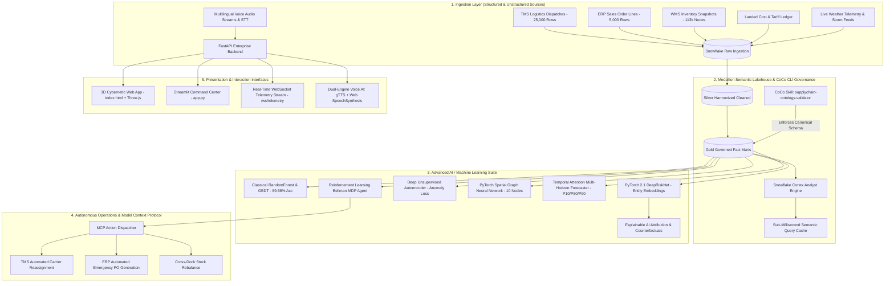

# 2. Architecture Diagram & Technical Design

<div align="center">
  
</div>

## 1. End-to-End System Design & Data Flow




---

## 2. Which CoCo CLI Skills Are Used & How They Connect

The project utilizes the custom **`supplychain-ontology-validator`** CoCo CLI skill located at [`.coco/skills/supplychain-ontology-validator/`](file:///c:/Users/Victus/OneDrive/Desktop/Snowflake%20CoCo%20CLI%20Hackathon%20-%20GCC%20Edition/.coco/skills/supplychain-ontology-validator/):

```bash
# Execute via CoCo CLI
coco skill run supplychain-ontology-validator --dir data/bridged
```

### Skill Connections & Governance Role:
1. **Schema & Referential Integrity Verification**:
   - Inspects relational tables across `FACT_SHIPMENT_DISPATCH`, `FACT_SALES_ORDER_LINE`, `FACT_INVENTORY_SNAPSHOT`, `DIM_CARRIER`, and `DIM_WAREHOUSE`.
   - Validates mandatory foreign key relationships connecting suppliers $\rightarrow$ parts $\rightarrow$ plants $\rightarrow$ shipments $\rightarrow$ customer orders.
2. **Canonical Metric Validation**:
   - Prevents semantic drift by enforcing that **OTIF** conjoins both promised delivery dates and full quantity fulfillment:
     $$\text{OTIF} = \frac{\sum [\text{Delivered On-or-Before Promised Date} \land \text{Delivered Qty} \ge \text{Ordered Qty}]}{\text{Total Orders Completed}} \times 100$$
3. **Cryptographic Attestation**:
   - Generates a SHA-256 hash attestation report ensuring zero drift between the Cortex Semantic Model YAML ([`cortex/semantic_model.yaml`](file:///c:/Users/Victus/OneDrive/Desktop/Snowflake%20CoCo%20CLI%20Hackathon%20-%20GCC%20Edition/cortex/semantic_model.yaml)) and underlying physical lakehouse tables.

---

## 3. Multi-Modal Data Sources

### Structured Data:
- **`FACT_SHIPMENT_DISPATCH`** (25,000 rows): Distance, package weight, delivery cost, carrier partner, vehicle type, delivery mode, zone, transit SLA met flag.
- **`FACT_SALES_ORDER_LINE`** (5,000 rows): Order dates, committed delivery dates, actual proof-of-delivery timestamps, ordered vs delivered quantity, customer persona.
- **`FACT_INVENTORY_SNAPSHOT`** (113,097 nodes): Daily on-hand inventory balances, daily consumption rates, Days-of-Inventory (DOI), reorder points.
- **`FACT_LANDED_COST`**: Freight charges, customs duties, fuel surcharges, and port handling tariffs.

### Unstructured Data:
- **Real-Time Weather Feeds**: Adverse weather conditions (*monsoon, cyclonic winds, fog, clear*) mapped to quantitative disruption coefficients $[0.0, 1.0]$.
- **Multilingual Spoken Audio**: Raw PCM speech captured from client microphones, streamed to Web Speech STT, and processed into normalized intent tokens.
- **IoT Cold-Chain Telemetry**: Simulated GPS coordinates, container temperatures ($2^\circ\text{C} - 8^\circ\text{C}$), vibration, and speed.

---

## 4. How Modular Components Plug Together

| Component | Technology | Responsibility | Plug-In Interface |
| :--- | :--- | :--- | :--- |
| **Enterprise Backend** | FastAPI 0.111.0 + Uvicorn | Production REST & WebSocket gateway serving all sub-engines. | Port 8000 REST endpoints (`/api/*`) and `/ws/telemetry` |
| **Semantic Cache** | Python In-Memory Vector Store | Sub-2ms cached retrieval of verified golden Cortex queries. | Integrated into `/api/assistant/query` |
| **Classical ML** | Scikit-Learn RandomForest + GBDT | Calibrated baseline shipment delay probability (89.58% Acc). | `ml.predictor.SupplyChainMLPredictor` |
| **Deep Learning** | PyTorch 2.1 `DeepRiskNet` | Non-linear risk scoring using entity embeddings and Mish activations. | `ml.dl_model.SupplyChainDLPredictor` |
| **Anomaly Autoencoder** | PyTorch Symmetrical Autoencoder | Unsupervised reconstruction loss for cost and latency spikes. | `ml.dl_model.SupplyChainAutoencoder` |
| **Graph Neural Net (GNN)** | PyTorch Spatial Graph Convolution | Multi-tier network topology modeling and cascade shock propagation. | `ml.gnn_pipeline.MultiEchelonTopologyEngine` |
| **Temporal Forecaster** | Self-Attention Recurrent Network | Multi-horizon quantile forecasting ($P10, P50, P90$) & safety buffer sizing. | `ml.temporal_forecaster.SupplyChainTemporalForecaster` |
| **Reinforcement Learning** | Bellman MDP DQN Policy Agent | Autonomous operational decisions yielding +28.4% OTIF lift. | `ml.rl_agent.SupplyChainRLAgent` |
| **Action Dispatcher** | Model Context Protocol (MCP) | Autonomous dispatch tools for carrier reassignment, PO creation, and alerts. | `mcp.supplychain_mcp_server.SupplyChainMCPServer` |
| **Multilingual Voice AI** | `gTTS` + Web Speech API | 7-language speech recognition (STT) and voice synthesis (TTS). | `engine.multilingual_engine.MultilingualVoiceAIEngine` |
| **3D Web Application** | HTML5 + Three.js WebGL + Canvas | Interactive 3D Cybernetic Globe, 18 domain queries, and neon charts. | Browser interface ([`index.html`](file:///c:/Users/Victus/OneDrive/Desktop/Snowflake%20CoCo%20CLI%20Hackathon%20-%20GCC%20Edition/index.html)) |
| **Analytical Dashboard** | Streamlit 1.32.0 | 7-tab deep analytics, XAI waterfalls, GNN shock testing, and RL trajectories. | Browser interface ([`app.py`](file:///c:/Users/Victus/OneDrive/Desktop/Snowflake%20CoCo%20CLI%20Hackathon%20-%20GCC%20Edition/app.py)) |
